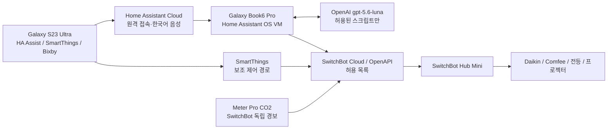

# Galaxy 스마트홈 구축 묶음

이 폴더는 Galaxy Book6 Pro에서 Home Assistant OS를 실행하고, 구형 적외선 가전을 SwitchBot Hub Mini로 안전하게 제어하기 위한 배포 파일입니다.

## 포함 내용

- `setup/`: VirtualBox/HAOS 설치, Windows 전원·자동 시작 설정, 호스트 검증 스크립트
- `home-assistant/packages/smart_home.yaml`: 기상·외출·귀가·영화·수면·환기 장면과 CO₂ 자동화
- `home-assistant/custom_components/switchbot_ir_allowlist/`: SwitchBot OpenAPI 명령을 허용 목록으로만 실행하는 Home Assistant 사용자 통합
- `home-assistant/custom_sentences/ko/`: 한국어 고정 명령 문장
- `home-assistant/configuration.yaml.example`: Home Assistant에 합칠 최소 구성 예시
- `home-assistant/secrets.yaml.example`: 계정 비밀값과 IR 가상 리모컨 ID 예시
- `home-assistant/openai_instructions_ko.txt`: OpenAI 대화 에이전트에 붙여 넣을 안전 지침
- `CHECKLIST.md`: 물리 리모컨 학습과 계정 연결을 포함한 최종 완료 절차
- `AGENTS.md`: ChatGPT/Codex가 이 저장소에서 작업할 때 지켜야 할 안전 규칙과 검증 절차

## 안전 설계

AI에는 장면과 프리셋 스크립트만 노출합니다. SwitchBot 토큰, 장치 ID, 임의 명령을 받는 서비스는 노출하지 않습니다. 적외선 명령은 전역 잠금으로 최소 2초 간격을 보장하며 자동 재시도하지 않습니다. 전원 토글만 있는 선풍기·프로젝터는 Home Assistant가 기록한 추정 상태를 기준으로 동작합니다.

## 적용 순서

1. `setup/00_run_host_setup_as_admin.ps1`를 실행하고 Windows 관리자 승인을 허용해 VirtualBox와 VM을 만듭니다.
2. 브라우저에서 `http://homeassistant.local:8123`을 열고 최초 계정을 생성합니다.
3. File editor 또는 Samba share 애드온으로 `home-assistant/`의 파일을 `/config` 아래에 복사합니다.
4. `configuration.yaml.example`의 내용을 실제 `/config/configuration.yaml`에 병합하고 `secrets.yaml.example`을 실제 값으로 채웁니다.
5. Home Assistant에서 구성 검사를 통과한 뒤 재시작합니다.
6. `CHECKLIST.md`에 따라 SwitchBot, Home Assistant Cloud, OpenAI, S23, SmartThings를 연결합니다.

## ChatGPT·MCP로 계속 구축하기

GitHub 저장소를 ChatGPT의 GitHub 커넥터에 연결한 뒤, 새 작업에서는 저장소 이름 `LEEJAEMO/My_SmarT_Home`과 원하는 변경을 함께 지정합니다. 에이전트는 먼저 `AGENTS.md`를 읽고 비밀값·IR 안전 규칙·검증 절차를 따라야 합니다.

실제 Token, Secret, API 키, Home Assistant의 `/config/.storage`, 데이터베이스, 백업, VM 디스크는 공개 저장소에 올리지 않습니다. 저장소에는 `secrets.yaml.example`처럼 자리표시자만 유지합니다.
