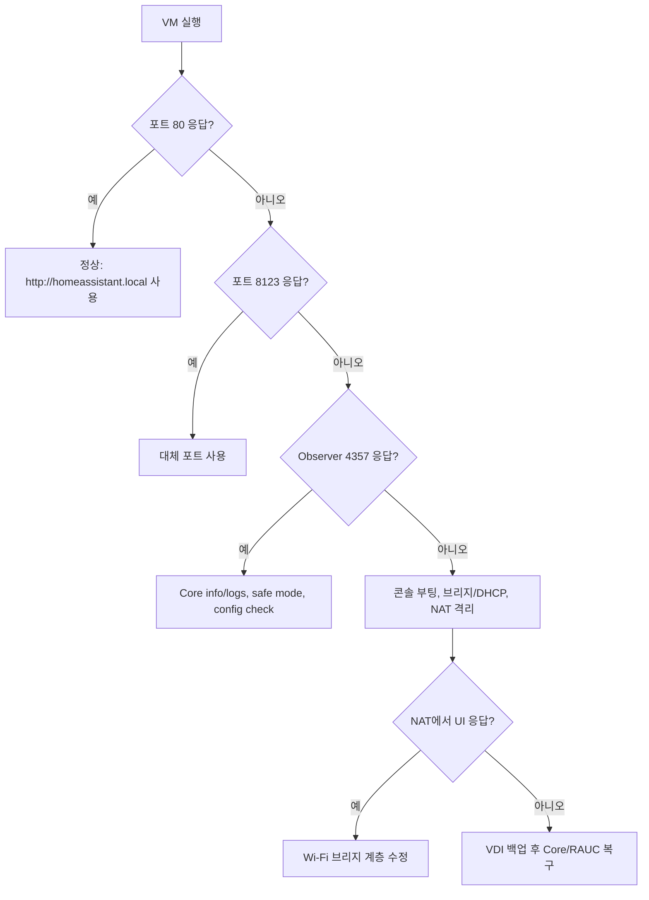

# HAOS VirtualBox 진단 및 복구

이 문서는 Windows 11, VirtualBox, Home Assistant OS 조합에서 “VM은 켜졌지만 Home Assistant가 열리지 않는다”는 증상을 데이터 삭제 없이 진단하는 절차다. `/config`, VDI, 백업을 보존하며 재설치·공장 초기화·데이터 디스크 초기화는 첫 단계에서 사용하지 않는다.

## 2026-09-22 확인 결과

현재 Galaxy Book의 `Home Assistant` VM에서 확인된 사실은 다음과 같다.

- VirtualBox `7.2.18 r175117`, HAOS `18.3`, Core `2026.9.3`
- VM의 브리지 IP `192.168.0.9`, mDNS `homeassistant.local`
- `http://192.168.0.9`와 포트 80은 정상 응답
- Observer `http://192.168.0.9:4357`은 `Connected / Supported / Healthy`
- 포트 8123은 닫혀 있었음
- HAOS/Supervisor 설치의 새 기본 포트 80을 8123 장애로 오판한 것이 직접 원인
- 부팅 중 `/dev/virtio-ports/org.qemu.guest_agent.0`을 최대 90초 기다리지만, 타임아웃 뒤 `System is ready`까지 정상 진행
- Windows Memory Integrity와 VBS가 켜져 있어 VirtualBox 로그에 `NEMR3Init: Snail execution mode is active`가 기록됨. 부팅 지연 요인이지만 이번 UI 불통의 직접 원인은 아님

Home Assistant 2026.8 이후 Supervisor 환경은 기본 포트 80을 사용한다. 먼저 아래 주소를 사용한다.

```text
http://homeassistant.local
```

포트 80을 다른 서비스가 이미 사용 중인 설치에서만 아래 주소를 시도한다.

```text
http://homeassistant.local:8123
```

## 원인 우선순위

| 순위 | 원인 | 구분 기준 | 현재 상태 |
| --- | --- | --- | --- |
| 1 | 포트 80 전환을 8123 장애로 오판 | 80은 HTTP 200, 8123은 닫힘 | 확인됨 |
| 2 | 정상 부팅 중 90초 장치 대기를 멈춤으로 오판 | 콘솔에 `org.qemu.guest_agent.0` 시작 작업 표시 후 진행 | 확인됨 |
| 3 | VBS/Memory Integrity 때문에 VirtualBox가 NEM snail mode 사용 | `VBox.log`에 snail mode 문구 | 확인됨, 성능 영향 |
| 4 | Wi-Fi 브리지 필터·DHCP 문제 | 80/8123/4357 모두 닫힘, ping·mDNS 실패 | 현재는 해당 없음 |
| 5 | Core 구성·DB·업데이트 문제 | Observer 4357은 정상이나 80과 8123이 모두 닫힘 | 조건부 조사 |

## 1. 한 번에 읽기 전용 진단

저장소 루트의 일반 PowerShell에서 실행한다.

```powershell
& '.\setup\05_diagnose_haos_vm.ps1'
```

IP를 직접 지정해야 하면 다음처럼 실행한다.

```powershell
& '.\setup\05_diagnose_haos_vm.ps1' -HomeAssistantHost '192.168.0.9'
```

JSON 증거 파일도 남기려면 공개 저장소 밖의 경로를 지정한다.

```powershell
& '.\setup\05_diagnose_haos_vm.ps1' `
  -HomeAssistantHost '192.168.0.9' `
  -EvidencePath "$env:LOCALAPPDATA\HomeAssistantVM\evidence\latest-diagnosis.json"
```

결과는 다음처럼 해석한다.

- `HomeAssistantPort80: True`: `http://homeassistant.local`을 연다.
- `HomeAssistantPort8123: True`: `http://homeassistant.local:8123`을 연다.
- `ObserverPort4357: True`이면서 두 UI 포트가 모두 `False`: OS와 Supervisor는 정상이며 Core 로그를 조사한다.
- 세 포트가 모두 `False`: VM 전원, 콘솔 부팅, 브리지, DHCP 순서로 조사한다.
- `VirtualBoxSnailExecutionMode: True`: VBS 경유 실행이다. 성능 비교 시험 대상이지만 네트워크 장애로 단정하지 않는다.

## 2. VirtualBox와 네트워크 상태 확인

```powershell
$vbox = "$env:ProgramFiles\Oracle\VirtualBox\VBoxManage.exe"
$vm = 'Home Assistant'

& $vbox list runningvms
& $vbox showvminfo $vm --machinereadable
Get-NetAdapterBinding -Name 'Wi-Fi' -ComponentID 'oracle_VBoxNetLwf'
Resolve-DnsName homeassistant.local
```

현재 화면을 파일로 저장할 수 있다.

```powershell
$evidence = "$env:LOCALAPPDATA\HomeAssistantVM\evidence"
New-Item -ItemType Directory -Path $evidence -Force | Out-Null
& $vbox controlvm $vm screenshotpng "$evidence\haos-console.png"
```

VM이 `poweroff`면 시작한다.

```powershell
& $vbox startvm $vm --type headless
```

부팅 후 최소 2분은 기다린다. 콘솔의 QEMU guest-agent 장치 대기는 VirtualBox에서 90초 타임아웃 뒤 진행될 수 있다.

## 3. HAOS 콘솔과 로그

VirtualBox Manager에서 `Home Assistant`을 선택하고 `표시`를 눌러 콘솔을 연다. `ha >` 프롬프트에서 다음을 실행한다.

```text
ha core info
ha core logs -n 100
ha core stats
ha supervisor info
ha supervisor logs -n 100
ha resolution info
ha network info
```

`ha core info`의 `port`가 실제 접속 포트다. 2026.8 이후 Supervisor 설치에서는 `80`이 정상 기본값이다.

Core만 격리 시험할 때는 다음을 사용한다.

```text
ha core restart --safe-mode
```

안전 모드에서도 Observer 4357만 열리고 UI 포트가 닫히면 사용자 정의 프런트엔드나 사용자 정의 통합 하나만의 문제로 단정하지 않는다. 로그와 Core 포트를 다시 확인한다. 정상 모드로 돌아갈 때는 다음을 실행한다.

```text
ha core restart
```

HAOS의 하위 OS 셸이 필요하면 로컬 `ha >` 프롬프트에서 다음을 입력한다.

```text
login
```

OS 셸에서는 읽기 전용 점검만 먼저 실행한다.

```sh
rauc status
docker ps
docker top homeassistant
docker logs --tail 100 homeassistant
journalctl -b -p warning
```

디버그 SSH 22222는 `authorized_keys` 가져오기가 별도로 필요하다. 현재처럼 로컬 콘솔을 사용할 수 있으면 먼저 활성화하지 않는다.

## 4. 안전한 VDI·VM 백업

실행 중인 VDI를 단순 복사하지 않는다. Home Assistant 콘솔에서 정상 종료한다.

```text
ha host shutdown
```

Windows PowerShell에서 `VMState="poweroff"`를 확인한다.

```powershell
$vbox = "$env:ProgramFiles\Oracle\VirtualBox\VBoxManage.exe"
$vm = 'Home Assistant'
& $vbox showvminfo $vm --machinereadable | Select-String '^VMState='
```

전원이 꺼진 뒤 정확한 바이트 복사본과 VM 설정을 백업한다.

```powershell
$sourceRoot = [IO.Path]::GetFullPath("$env:LOCALAPPDATA\HomeAssistantVM\vm")
$backupRoot = [IO.Path]::GetFullPath("$env:LOCALAPPDATA\HomeAssistantVM\backups\$(Get-Date -Format yyyyMMdd-HHmmss)")
$allowedParent = [IO.Path]::GetFullPath("$env:LOCALAPPDATA\HomeAssistantVM\backups")

if (-not $backupRoot.StartsWith($allowedParent, [StringComparison]::OrdinalIgnoreCase)) {
    throw '백업 경로 검증 실패'
}

New-Item -ItemType Directory -Path $backupRoot | Out-Null
Copy-Item -LiteralPath "$sourceRoot\haos_ova-18.3.vdi" -Destination "$backupRoot\haos_ova-18.3.vdi"
Copy-Item -LiteralPath "$sourceRoot\Home Assistant\Home Assistant.vbox" -Destination $backupRoot
Copy-Item -LiteralPath "$sourceRoot\Home Assistant\Home Assistant.nvram" -Destination $backupRoot

Get-FileHash -Algorithm SHA256 -LiteralPath "$sourceRoot\haos_ova-18.3.vdi"
Get-FileHash -Algorithm SHA256 -LiteralPath "$backupRoot\haos_ova-18.3.vdi"
```

두 VDI 해시가 같아야 한다. `VBoxManage clonemedium`으로 만든 복제본은 새 VDI UUID 때문에 파일 해시가 달라지는 것이 정상이다.

## 5. 임시 NAT 격리 시험

현재처럼 포트 80과 mDNS가 정상인 경우 NAT 시험은 불필요하다. 세 포트가 모두 닫혀 있고 브리지 문제를 분리해야 할 때만 수행한다.

먼저 현재 설정을 저장하고, VM을 정상 종료한 뒤 `poweroff`를 확인한다.

```powershell
$vbox = "$env:ProgramFiles\Oracle\VirtualBox\VBoxManage.exe"
$vm = 'Home Assistant'
$evidence = "$env:LOCALAPPDATA\HomeAssistantVM\evidence"
New-Item -ItemType Directory -Path $evidence -Force | Out-Null

$vmInfo = & $vbox showvminfo $vm --machinereadable
$vmInfo | Set-Content -LiteralPath "$evidence\before-nat.txt" -Encoding utf8
$bridge = (($vmInfo | Select-String '^bridgeadapter1=').Line -replace '^bridgeadapter1="|"$','')
```

NAT와 두 진단용 포트 포워딩을 설정한다.

```powershell
& $vbox modifyvm $vm --nic1 nat
& $vbox modifyvm $vm --natpf1 'ha-http80,tcp,127.0.0.1,18080,,80'
& $vbox modifyvm $vm --natpf1 'ha-http8123,tcp,127.0.0.1,18123,,8123'
& $vbox startvm $vm --type headless
```

2분 뒤 다음 두 주소를 시험한다.

```text
http://127.0.0.1:18080
http://127.0.0.1:18123
```

- 둘 중 하나가 열림: HAOS/Core는 정상이며 Wi-Fi 브리지 계층 문제다.
- 둘 다 닫히고 Observer도 확인할 수 없음: Core 또는 부팅 문제를 콘솔에서 조사한다.

시험 후 VM을 정상 종료하고 원래 브리지로 되돌린다.

```powershell
& $vbox modifyvm $vm --natpf1 delete 'ha-http80'
& $vbox modifyvm $vm --natpf1 delete 'ha-http8123'
& $vbox modifyvm $vm --nic1 bridged --bridgeadapter1 $bridge
& $vbox startvm $vm --type headless
```

## 6. Hyper-V, VBS, Memory Integrity

읽기 전용 확인 명령은 다음과 같다.

```powershell
Get-CimInstance -ClassName Win32_DeviceGuard -Namespace 'root\Microsoft\Windows\DeviceGuard' |
  Select-Object VirtualizationBasedSecurityStatus,SecurityServicesConfigured,SecurityServicesRunning

Get-ItemProperty -LiteralPath 'HKLM:\SYSTEM\CurrentControlSet\Control\DeviceGuard\Scenarios\HypervisorEnforcedCodeIntegrity' |
  Select-Object Enabled

systeminfo | Select-String 'Hyper-V|hypervisor|가상화'
```

`VBox.log`에서 다음 문구를 찾는다.

```powershell
$log = "$env:LOCALAPPDATA\HomeAssistantVM\vm\Home Assistant\Logs\VBox.log"
Select-String -LiteralPath $log -Pattern 'Snail execution mode|Attempting fall back to NEM|VERR_CPUM_RAISE_GP_0'
```

`VERR_CPUM_RAISE_GP_0`만으로 치명 오류로 판단하지 않는다. VM이 `System is ready`까지 도달하고 네트워크가 응답하면 부팅 실패 증거가 아니다.

직접 VT-x와 NEM의 성능 차이를 시험하려면 Windows 보안 기능을 일시적으로 낮춰야 한다. 이는 보안 영향이 있으므로 백업 후 사용자가 명시적으로 선택할 때만 한다.

1. Windows 보안 → 장치 보안 → 코어 격리 → 메모리 무결성을 끈다.
2. 관리자 PowerShell에서 실행한다.

```powershell
bcdedit /set hypervisorlaunchtype off
Restart-Computer
```

시험 후 즉시 원복한다.

```powershell
bcdedit /set hypervisorlaunchtype auto
Restart-Computer
```

재부팅 뒤 메모리 무결성도 다시 켠다. 스마트홈이 포트 80에서 정상 응답한다면 이 시험은 필요하지 않다.

## 7. 최후 복구 순서

다음 순서는 VDI 백업이 검증된 뒤에만 진행한다.

1. `ha core check`로 구성 검사를 실행한다.
2. `ha core restart --safe-mode`로 사용자 정의 구성 영향을 분리한다.
3. Core 이미지 손상이 의심될 때 `ha core rebuild` 후 `ha core restart`를 실행한다. `/config`는 유지되지만 먼저 VDI 백업을 보유한다.
4. OS 셸에서 `rauc status`로 A/B 슬롯을 확인한다.
5. 현재 슬롯 자체가 손상되었다는 로그 증거가 있을 때만 `rauc status mark-active other`로 다른 슬롯을 다음 부팅 대상으로 지정하고 `systemctl reboot`한다.
6. 그래도 실패하면 원본 VDI는 보존하고, 바이트 복사본 또는 `VBoxManage clonemedium` 복제본을 별도 복구 VM에 연결해 시험한다.

다음 명령은 사용하지 않는다.

```text
ha os datadisk wipe
```

이 명령은 사용자 데이터 전체를 지우므로 이 복구 절차의 범위 밖이다.

## 8. 증거별 분기 요약



## 공식 근거

- Home Assistant 설치 안내: https://www.home-assistant.io/installation/windows/
- Home Assistant OS 공통 작업과 CLI: https://www.home-assistant.io/common-tasks/os
- HAOS 디버깅: https://developers.home-assistant.io/docs/operating-system/debugging/
- HAOS A/B 업데이트 슬롯: https://developers.home-assistant.io/docs/operating-system/update-system/
- VirtualBox 기술 배경과 paravirtualization: https://www.virtualbox.org/manual/ch10.html
- RAUC 슬롯 전환: https://rauc.readthedocs.io/en/latest/using.html#manually-switch-to-a-different-slot
