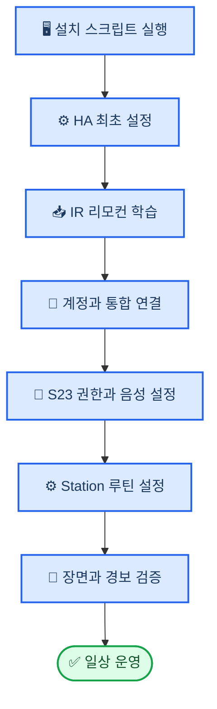

# 스마트홈 사용자 설정 및 운영 매뉴얼

_Galaxy S23 Ultra · Galaxy Book6 Pro · SwitchBot Hub Mini 기반 시스템의 사용자 설정·운영 가이드_

---

## 📋 이 문서의 목적

이 문서는 이미 준비된 Home Assistant 자동화 묶음을 실제 집의 SwitchBot 장치, 적외선 가전, Galaxy S23 Ultra 및 SmartThings에 연결하는 순서다. 아래 순서를 지키면 토큰이나 장치 ID를 잘못 넣는 일, 그리고 프로젝터 전원 토글로 인한 오동작을 줄일 수 있다.

현재 준비가 끝난 항목과 사용자가 직접 해야 할 항목은 다음과 같다.

| 구분 | 상태 | 사용자 작업 |
| --- | --- | --- |
| HAOS 가상 디스크 | 18.3 실행 확인 | 복구 백업 보존 |
| Galaxy Book AC 절전 해제 | 적용 완료 | 노트북을 전원에 연결해 운영 |
| VirtualBox·HA 가상머신 | 실행 확인 | `http://homeassistant.local` 접속 확인 |
| SwitchBot IR 리모컨 | 미학습 | 실제 리모컨으로 학습·반복 시험 |
| Home Assistant 계정·통합 | 미연결 | 최초 계정 및 서비스 로그인 |
| S23 위치·알림·음성 | 미설정 | 권한 허용 및 Assist 기본 앱 설정 |
| SmartThings Station | 미설정 | 버튼별 루틴 지정·실기기 확인 |

### 전체 흐름



> ⚠️ **중요:** 프로젝터는 스마트 플러그로 강제 전원을 차단하지 않는다. 냉각 팬이 멈출 시간을 확보하려면 반드시 리모컨의 정상 종료 신호를 사용한다.

> 📌 **기준:** 일상 제어는 Home Assistant 앱/Assist를 우선한다. Galaxy Book이 꺼졌을 때에는 SwitchBot 앱, SmartThings 앱, CO₂ 센서의 SwitchBot 알림을 보조 경로로 사용한다.

## 🏠 시작 전 준비

### 운영 환경 확인

- [ ] Galaxy Book을 전원에 연결한다
- [ ] Galaxy Book이 집 Wi-Fi에 연결되어 있는지 확인한다
- [ ] SwitchBot Hub Mini, 커튼, Meter Pro CO₂가 SwitchBot 앱에서 이미 보이는지 확인한다
- [ ] Hub Mini가 다이킨 에어컨, Comfee 선풍기, 전등, 프로젝터를 모두 향하도록 고정한다
- [ ] CO₂ 센서를 USB Type-C 5V/1A 전원에 연결한다
- [ ] SwitchBot, SmartThings, Home Assistant 앱을 최신 버전으로 업데이트한다

Meter Pro CO₂는 배터리 사용 시 30분마다, 5V/1A USB 전원 사용 시 기본 1분마다 CO₂를 갱신한다.[^1] 이 시스템에서는 빠른 환기 알림을 위해 USB 전원을 기본으로 한다.

### 준비된 파일 위치

이 문서에서 말하는 구축 파일은 이 GitHub 저장소를 복제한 로컬 폴더에 있다.

```text
My_SmarT_Home\
```

| 용도 | 파일 또는 폴더 |
| --- | --- |
| 관리자 설치 실행 | `setup\00_run_host_setup_as_admin.ps1` |
| 설치 상태 확인 | `setup\03_validate_host.ps1` |
| SwitchBot 장치 ID 확인 | `setup\04_discover_switchbot_devices.ps1` |
| 자동화 패키지 | `home-assistant\packages\smart_home.yaml` |
| IR 허용 목록 통합 | `home-assistant\custom_components\switchbot_ir_allowlist` |
| 한국어 명령 | `home-assistant\custom_sentences\ko\smart_home.yaml` |
| AI 안전 지침 | `home-assistant\openai_instructions_ko.txt` |
| 상세 구축 체크리스트 | `CHECKLIST.md` |

## 🔧 1단계 — Galaxy Book에 Home Assistant 시작하기

### 관리자 설치 실행

Galaxy Book에서 PowerShell을 열고 아래 명령을 실행한다. Windows 관리자 승인 창이 나타나면 `예`를 선택한다.

```powershell
powershell -ExecutionPolicy Bypass -File ".\setup\00_run_host_setup_as_admin.ps1"
```

이 스크립트는 VirtualBox를 설치하고 `Home Assistant` VM을 만든다. VM은 2 vCPU, RAM 4GB, 32GB 가상 디스크, EFI, Wi-Fi 브리지 네트워크로 설정된다. 공식 Windows 설치 안내에서도 최소 2 vCPU·2GB RAM, EFI, 인터넷에 연결된 실제 어댑터를 쓰는 브리지 네트워크를 요구한다.[^2]

### 최초 접속과 확인

설치 창이 완료되면 브라우저에서 아래 주소를 연다. 첫 시작은 5~20분이 걸릴 수 있다.

```text
http://homeassistant.local
```

열리지 않으면 다음 순서로 시도한다.

1. `http://homeassistant`을 연다
2. VM 콘솔 또는 공유기 DHCP 목록에서 VM의 IP를 확인한 후 `http://IP주소`를 연다
3. 포트 80이 다른 서비스에 사용 중인 설치에서만 `http://homeassistant.local:8123` 또는 `http://IP주소:8123`을 연다
4. 아래 상태 점검 명령을 실행한다

```powershell
& ".\setup\03_validate_host.ps1"
```

`VirtualBoxInstalled: True`, `VmExists: True`, `VmState: running`, `HomeAssistantLocalPort: True`가 확인되면 정상이다. `HomeAssistantUrl`에 실제 접속 주소가 표시된다. Home Assistant 2026.8 이후 HAOS/Supervisor 설치는 기본 포트 80을 사용하며, 포트 80을 사용할 수 없을 때 8123을 사용한다.[^2]

### Home Assistant 최초 계정

- [ ] Home Assistant 관리자 계정을 만든다
- [ ] 시간대를 `Asia/Tokyo`로 확인한다
- [ ] 집 위치를 실제 주소로 설정한다. 일출·일몰 장면에 필요하다
- [ ] 기본 대시보드가 열리는지 확인한다

> 💡 **운영 팁:** 로그인 후 30초 뒤 VM이 자동으로 시작되도록 설정된다. 하지만 Galaxy Book을 완전히 종료하면 Home Assistant도 멈춘다. 외출 중에는 SwitchBot·SmartThings의 보조 제어와 CO₂ 독립 알림을 사용한다.

## 📥 2단계 — SwitchBot 적외선 리모컨 학습

### 공통 원칙

각 학습 버튼은 SwitchBot 앱에서 **5회씩** 시험한다. 버튼을 누를 때마다 실제 가전이 정확히 한 번만 동작하고, Hub Mini의 IR 시야가 막히지 않는지 확인한다.

- [ ] Hub Mini와 가전 사이에 장애물이 없다
- [ ] 각 가전의 물리 리모컨 배터리가 충분하다
- [ ] SwitchBot 앱에서 학습 후 이름을 아래 표와 정확히 맞춘다
- [ ] 5회 시험 결과를 이 문서 아래의 기록표에 적는다

### 다이킨 구형 에어컨

`스마트 매칭`이나 제조사 모델 검색이 아니라 SwitchBot 앱의 `에어컨 → 버튼 학습(Learn Buttons)`을 사용한다. 에어컨 리모컨의 신호는 운전 모드·온도·풍량이 결합되어 있으므로 온도만 따로 학습할 수 없다. SwitchBot은 ON/OFF 두 버튼을 제공하며, 자주 쓰는 운전 상태마다 별도 가상 리모컨을 만들 수 있다.[^3]

| SwitchBot 가상 리모컨 이름 | 물리 리모컨에서 만든 뒤 학습할 상태 | HA에서 부르는 기능 |
| --- | --- | --- |
| `다이킨_냉방26` | 냉방 · 26℃ · 풍량 자동 · ON | 에어컨 냉방 26도 시작 |
| `다이킨_난방20` | 난방 · 20℃ · 풍량 자동 · ON | 에어컨 난방 20도 시작 |
| `다이킨_제습` | 평소 쓰는 제습 설정 · ON | 에어컨 제습 시작 |
| `다이킨_OFF` | 전원 OFF | 에어컨 끄기 |

- [ ] 네 가지 프리셋을 학습한다
- [ ] 냉방26, 난방20, 제습의 ON 신호가 정확한 상태로 켜지는지 5회씩 확인한다
- [ ] OFF 신호가 현재 켜진 상태에서 항상 정상 종료하는지 5회 확인한다

> ⚠️ **제한:** “냉방 25도로 켜”처럼 학습하지 않은 임의 온도는 지원하지 않는다. AI와 음성 명령은 냉방 26도, 난방 20도, 제습, 끄기만 실행해야 한다.

### Comfee 선풍기

먼저 SwitchBot 앱에서 `Fan` 유형으로 추가한다. 필요한 버튼을 모두 학습·시험한 뒤, 버튼이 Home Assistant/OpenAPI에 보이지 않으면 `Others` 유형으로 다시 추가한다.

| 기능 | 반드시 사용할 버튼명 |
| --- | --- |
| 전원 | `전원` |
| 풍량 | `약풍`, `중풍`, `강풍` |
| 부가 기능 | `회전`, `자연풍`, `2시간타이머` |

- [ ] 선풍기 전원은 토글인지, 분리 ON/OFF인지 확인한다
- [ ] 토글형이면 Home Assistant가 기록한 추정 상태가 실제 상태와 다를 수 있으므로 물리 리모컨 사용을 최소화한다
- [ ] 약풍, 중풍, 강풍, 회전, 자연풍, 2시간 타이머를 각각 5회 시험한다

### 전등과 프로젝터

| 기기 | 학습 버튼명 | 주의점 |
| --- | --- | --- |
| 전등 | `ON`, `OFF`, `밝기증가`, `밝기감소` | ON/OFF가 분리된 신호인지 확인 |
| 프로젝터 | `ON`, `OFF` | 분리 신호가 있으면 최선 |
| 프로젝터 토글형 | `전원` | HA가 켰다고 기록한 경우에만 끄기 신호 사용 |

- [ ] 프로젝터가 ON/OFF 분리형이면 Home Assistant의 `프로젝터 ON/OFF 분리 코드 사용` 도우미를 켠다
- [ ] 프로젝터가 토글형이면 실제 꺼진 상태에서 `프로젝터 추정 전원`을 꺼짐으로 맞춘다
- [ ] 프로젝터 종료 후 냉각 팬이 충분히 돌아가고 멈추는지 확인한다

## 🔗 3단계 — Home Assistant 파일과 계정 연결

### 구성 파일 배포

Home Assistant에서 `설정 → 애드온 → 애드온 스토어`로 가서 `File editor` 애드온을 설치한다. 그 다음 아래의 소스 폴더 내용을 HA의 `/config` 폴더에 같은 구조로 복사한다.

| 로컬 소스 | HA 대상 |
| --- | --- |
| `home-assistant\custom_components` | `/config/custom_components` |
| `home-assistant\packages` | `/config/packages` |
| `home-assistant\custom_sentences` | `/config/custom_sentences` |
| `home-assistant\dashboards` | `/config/dashboards` |

그 후 `configuration.yaml.example`의 내용을 기존 `/config/configuration.yaml`에 **병합**한다. 기존 `default_config:`는 삭제하지 않는다. `secrets.yaml.example`을 참고해 실제 `/config/secrets.yaml`을 만든다.

> ⚠️ **보안:** SwitchBot Token, Secret, OpenAI API 키는 스크린샷·메신저·Obsidian 동기화 노트에 넣지 않는다. `/config/secrets.yaml`에만 보관한다.

### SwitchBot Cloud 통합

1. Home Assistant에서 `설정 → 기기 및 서비스 → 통합 추가 → SwitchBot Cloud`를 연다
2. SwitchBot 앱 `프로필 → 환경설정 → About → Developer Options`에서 Token과 Secret을 발급한다
3. Token과 Secret을 입력하고 통합을 완료한다
4. 커튼, Meter Pro CO₂, 표시 가능한 IR 기기가 나타나는지 확인한다

SwitchBot Cloud는 Hub를 통해 연결된 장치를 제어한다. 앱에서 설정한 장치 이름도 Home Assistant로 넘어오며, Cloud 통합에는 Token과 Secret이 필요하다.[^4]

### SwitchBot 장치 ID 입력

Home Assistant가 실행 중인 Galaxy Book에서 아래 명령을 실행한다. 입력하는 Token/Secret은 콘솔에 보이지 않는다.

```powershell
& ".\setup\04_discover_switchbot_devices.ps1"
```

출력된 IR 가상 리모컨 `deviceId`를 `/config/secrets.yaml`의 대응 항목에 넣는다. 정확한 대응은 원본 `home-assistant/secrets.yaml.example`의 주석을 따른다.

### Home Assistant Cloud

Home Assistant의 `설정 → Home Assistant Cloud`에서 로그인 또는 구독을 진행한다. 이 단계는 외부 접속과 Cloud 기반 음성 처리를 쓸 때 필요하며, 결제가 발생할 수 있으므로 사용자가 직접 확인한다.

### OpenAI 대화 에이전트

1. OpenAI 플랫폼에서 API 결제 수단과 **낮은 월 사용 한도**를 먼저 설정한다
2. API 키를 만든다
3. Home Assistant에서 `설정 → 기기 및 서비스 → 통합 추가 → OpenAI`를 연다
4. 모델을 `gpt-5.6-luna`로 설정한다
5. `home-assistant/openai_instructions_ko.txt`의 내용을 지침란에 붙여 넣는다
6. 웹 검색과 요청·응답 저장은 끈다

Home Assistant의 OpenAI 통합은 노출된 Assist 엔티티만 읽거나 제어할 수 있다. API 사용은 유료이므로 OpenAI 사용 한도를 설정하고 비용을 점검해야 한다.[^5]

### AI와 Assist에 노출할 항목

`설정 → 음성 어시스턴트 → 노출`에서 아래만 노출한다.

- [ ] 에어컨 프리셋 4개: 냉방 26도, 난방 20도, 제습, 끄기
- [ ] 선풍기 프리셋: 약풍, 중풍, 강풍, 회전, 자연풍, 2시간 타이머, 끄기
- [ ] 전등과 프로젝터 제어 스크립트
- [ ] 기상, 외출, 귀가, 영화, 수면, 환기 장면
- [ ] 커튼
- [ ] CO₂·온도 센서만 읽기 용도로 노출

아래는 노출하지 않는다.

- [ ] `switchbot_ir_allowlist.send` 원시 서비스
- [ ] SwitchBot Token, Secret, 장치 ID
- [ ] `input_text` 및 `input_boolean` 설정 도우미
- [ ] 임의 명령을 보낼 수 있는 OpenAPI 기능

## 📱 4단계 — Galaxy S23 Ultra 설정

### Home Assistant Companion 앱

1. S23에 Home Assistant Companion 앱을 설치하고 Cloud 원격 URL로 로그인한다
2. 앱 알림을 허용한다
3. Android 위치 권한을 `항상 허용`으로, 위치 정확도를 켠다
4. 앱 배터리 사용량을 `제한 없음`으로 설정한다
5. Companion 앱 `설정 → Companion app → Manage sensors`에서 위치 센서를 켠다
6. Home Assistant에 생성된 `person` 엔티티가 집/외출 상태를 바꾸는지 확인한다

위치 센서는 10분 외출 감지 및 귀가 장면의 기준이다. 배터리 최적화가 켜져 있으면 백그라운드 위치 갱신과 알림이 지연될 수 있다.

### Assist를 기본 음성 앱으로 지정

Home Assistant 앱에서 `Settings → Companion app → Assist for Android → Set as default`를 누른 뒤, Android의 기본 디지털 어시스턴트 앱으로 Home Assistant를 선택한다. 이후 전원 버튼 길게 누르기, 화면 하단 모서리 스와이프 등의 Android 제스처로 Assist를 호출할 수 있다.[^6]

- [ ] 홈 화면에 Assist 위젯을 추가한다
- [ ] `냉방 26도로 켜`, `선풍기 강풍`, `영화 모드`, `환기 시작`을 테스트한다
- [ ] 잠금 화면에서 Assist가 열리는지 확인한다

`Hey Nabu` 깨우기 기능은 선택 사항이다. Android에서 실험 기능이며 배터리 사용량이 늘 수 있으므로, 우선 위젯과 기본 어시스턴트가 안정적으로 동작한 뒤에 켠다.[^6]

## ⚙️ 5단계 — SmartThings와 Station 버튼

### SwitchBot 계정 연결

SmartThings 앱에서 `기기 → + → 기기 추가`를 열고 `SwitchBot`을 검색한다. SwitchBot 브랜드를 선택한 뒤 SwitchBot 계정으로 로그인한다. 연결이 끝나면 SwitchBot 장치가 SmartThings의 기기 화면에 나타난다.[^7]

- [ ] 커튼이 SmartThings에 보이는지 확인한다
- [ ] 표시되는 IR 기기의 ON/OFF가 실제로 동작하는지 확인한다
- [ ] Bixby에서는 단순한 전원/커튼 명령만 보조 제어로 사용한다

### SmartThings Station 버튼

Station의 버튼 루틴은 다음 의미로 사용한다.

| 동작 | 장면 | 기대 결과 |
| --- | --- | --- |
| 짧게 누르기 | 영화 | 커튼 닫기 → 전등 끄기 → 프로젝터 켜기 |
| 두 번 누르기 | 환기 | 에어컨 끄기 → 선풍기 강풍 |
| 길게 누르기 | 수면 | 커튼 닫기 → 전등·프로젝터 끄기 → 선풍기 약풍 2시간 |

SmartThings에 표시되는 기기만으로 장면이 완성되지 않으면 Station 루틴에서 일부 동작을 억지로 추가하지 않는다. 특히 사용자 지정 `Others` IR 버튼이 보이지 않는 경우에는 S23의 Home Assistant 대시보드 또는 Assist로 해당 장면을 실행한다.

> 📌 **확인 방법:** 각 버튼 동작을 한 번씩 실행하고, 전등·커튼·프로젝터·선풍기가 기대 순서로 동작하는지 직접 본다. Station 버튼이 Home Assistant에 이벤트로 노출되는 경우에만, 그 이벤트를 HA 장면 스크립트에 연결한다.

## 📊 6단계 — CO₂ 경보와 장면 자동화

### SwitchBot 앱 독립 경보

Galaxy Book이 꺼졌을 때도 경보를 받기 위해 SwitchBot 앱에 자동화를 별도로 만든다.

| 조건 | SwitchBot 앱 동작 | 목적 |
| --- | --- | --- |
| CO₂ ≥ 1000ppm | 일반 환기 알림 | 환기 시작 알림 |
| CO₂ ≥ 1500ppm | 긴급 재알림 | 즉시 창문 열기 |

Home Assistant의 SwitchBot Cloud 센서는 클라우드 폴링 특성 때문에 즉시 반영되지 않을 수 있다. 안전 경보의 주 경로는 SwitchBot 앱 알림으로 남겨 둔다.[^4]

### Home Assistant 장면 확인

| 장면 | 실행 조건 또는 수동 명령 | 예상 동작 |
| --- | --- | --- |
| 기상 | 일출 30분 후, 단 06:30 이전에는 대기 | 재실 시 커튼 열기·전등 켜기 |
| 외출 | S23가 집 밖에 10분 유지 | 에어컨·선풍기·전등 끄기, 커튼 닫기 |
| 귀가 | S23가 집에 들어옴 | 낮 커튼 열기, 밤 전등 켜기, 온도 분기 |
| 영화 | `영화 모드` | 커튼 닫기 → 전등 끄기 → 2초 후 프로젝터 켜기 |
| 수면 | `수면 모드` | 커튼 닫기, 전등·프로젝터 끄기, 약풍 2시간 |
| 환기 | 창문을 연 뒤 `환기 시작` | 에어컨 끄기, 선풍기 강풍 |

환기 장면은 창문을 자동으로 제어하지 않는다. CO₂가 800ppm 아래에서 10분 유지되면 선풍기를 끄고, 창문을 직접 닫으라는 S23 알림을 보낸다.

## 🧪 7단계 — 최종 검증 기록

설정 직후 한 번에 모든 자동화를 실행하지 말고, 아래 순서대로 한 항목씩 실기기 동작을 확인한다.

### 적외선·장면 검증

- [ ] 다이킨 냉방 26도 프리셋 5회 성공
- [ ] 다이킨 난방 20도 프리셋 5회 성공
- [ ] 다이킨 제습 프리셋 5회 성공
- [ ] 다이킨 OFF 신호 5회 성공
- [ ] 선풍기 약·중·강풍, 회전, 자연풍, 2시간 타이머, OFF 확인
- [ ] 전등 ON/OFF·밝기 증가·감소 확인
- [ ] 프로젝터 ON/OFF와 냉각 팬 정상 종료 확인
- [ ] 영화 장면의 2초 대기 후 프로젝터 동작 확인

### 음성·자동화 검증

- [ ] `냉방 26도로 켜`가 냉방 26도 프리셋만 실행
- [ ] `냉방 25도로 켜`가 실행되지 않고 지원 프리셋을 안내
- [ ] `선풍기 강풍`, `영화 모드`, `환기 시작` 확인
- [ ] S23이 집 밖에 10분 유지될 때 외출 장면 확인
- [ ] S23 귀가 때 낮/밤 분기 확인
- [ ] 실내 온도 28℃ 초과 시 귀가 냉방26, 16℃ 미만 시 난방20 확인
- [ ] 수면 장면에서 24℃ 이상 냉방26, 18℃ 이하 난방20 확인
- [ ] CO₂ 1000ppm·1500ppm 경보, 800ppm 아래 10분 환기 완료 알림 확인
- [ ] Galaxy Book 재부팅 후 Home Assistant 복구 확인
- [ ] Galaxy Book을 끈 상태에서 SwitchBot 앱·SmartThings 기본 제어·CO₂ 경보 확인

### 시험 기록표

| 날짜 | 시험 항목 | 결과 | 실제 기기 상태 | 메모 |
| --- | --- | --- | --- | --- |
|  |  | ⬜ 성공 / ⬜ 실패 |  |  |
|  |  | ⬜ 성공 / ⬜ 실패 |  |  |
|  |  | ⬜ 성공 / ⬜ 실패 |  |  |

## 🔄 일상 운영과 복구

### 일상 사용 규칙

- 음성·앱 제어를 기본으로 하고, 물리 리모컨은 가급적 쓰지 않는다
- 물리 리모컨을 사용했다면 Home Assistant의 에어컨·선풍기·프로젝터 추정 상태를 실제 상태에 맞춰 수동으로 고친다
- 환기 장면 실행 전에는 반드시 사용자가 창문을 연다
- 프로젝터는 종료 후 냉각이 끝날 때까지 전원을 건드리지 않는다
- Galaxy Book은 가능하면 전원 연결·Wi-Fi 연결 상태로 유지한다

### 점검 주기

| 주기 | 점검 내용 |
| --- | --- |
| 매주 | S23 위치 감지·CO₂ 알림·주요 장면 1회 시험 |
| 매월 | SwitchBot/SmartThings/HA 앱 업데이트, Hub IR 시야 확인 |
| 계절 전환 전 | 다이킨 냉방26·난방20 학습 신호 재시험 |
| 오류 발생 후 | 물리 리모컨 상태와 HA 추정 상태 동기화 |

### 자주 생기는 문제

| 증상 | 먼저 확인할 것 | 해결 |
| --- | --- | --- |
| `homeassistant.local:8123`이 열리지 않음 | 포트 80 기본값 변경 여부 | `http://homeassistant.local`을 먼저 열고 진단 스크립트로 실제 포트 확인 |
| `homeassistant.local`도 열리지 않음 | Galaxy Book 전원·VM·Observer 상태 | `setup/05_diagnose_haos_vm.ps1` 실행 후 `docs/HAOS VirtualBox 진단 및 복구.md`의 분기표 확인 |
| IR 명령이 가끔 안 먹음 | Hub Mini의 시야·거리 | Hub 위치를 바꾸고 버튼을 5회 재시험 |
| 선풍기가 반대로 꺼짐/켜짐 | 물리 리모컨 사용 여부 | 실제 상태에 맞춰 추정 상태를 고친 뒤 실행 |
| 프로젝터가 켜지지 않음 | ON/OFF 분리 코드 여부 | 토글형이면 추정 상태를 실제 상태와 일치 |
| 외출 자동화가 늦음 | S23 위치 권한·배터리 제한 | 위치 `항상 허용`, 배터리 `제한 없음` 재확인 |
| CO₂ 알림이 늦음 | 센서 전원·SwitchBot 앱 알림 | USB 5V/1A 연결 및 앱 경보를 주 경로로 유지 |
| AI가 너무 많은 것을 제어함 | Assist 노출 목록 | 원시 IR 서비스와 설정 도우미를 노출 해제 |

<details>
<summary><strong>📋 빠른 복구 카드</strong></summary>

| 상황 | 즉시 할 일 |
| --- | --- |
| Galaxy Book이 꺼짐 | SwitchBot 앱/SmartThings 앱으로 기본 제어, CO₂ 경보 확인 |
| 가전 실제 상태가 불명확 | 물리 리모컨 또는 기기 표시등으로 먼저 확인 |
| 프로젝터 상태 불명확 | 전원 토글을 보내지 말고 실제 상태 확인 |
| 에어컨이 예상과 다름 | OFF 후 10초 기다리고 원하는 프리셋 ON을 한 번만 전송 |
| OpenAI 비용 우려 | OpenAI 프로젝트 사용 한도 확인, OpenAI 통합 일시 비활성화 |

</details>

---

## 🔗 참고 자료

[^1]: SwitchBot Help Center. (2026). "Update Frequency of CO2 Readings on SwitchBot Meter Pro (CO2 Monitor)." https://support.switch-bot.com/hc/en-us/articles/26502008033303-Update-Frequency-of-CO2-Readings-on-SwitchBot-Meter-Pro-CO2-Monitor

[^2]: Home Assistant. (2026). "Windows." https://www.home-assistant.io/installation/windows/

[^3]: SwitchBot Help Center. (2026). "How to Add Air Conditioner Remotes by Learn Buttons Mode." https://support.switch-bot.com/hc/en-us/articles/360038373593-How-to-Add-Air-Conditioner-Remotes-by-Learn-Buttons-Mode

[^4]: Home Assistant. (2026). "SwitchBot Cloud." https://www.home-assistant.io/integrations/switchbot_cloud

[^5]: Home Assistant. (2026). "OpenAI." https://www.home-assistant.io/integrations/openai_conversation

[^6]: Home Assistant. (2026). "Assist on Android." https://www.home-assistant.io/voice_control/android/

[^7]: SwitchBot Help Center. (2024). "How Does SwitchBot Work with SmartThings?" https://support.switch-bot.com/hc/en-us/articles/12881565557783-How-Does-SwitchBot-Work-with-SmartThings
